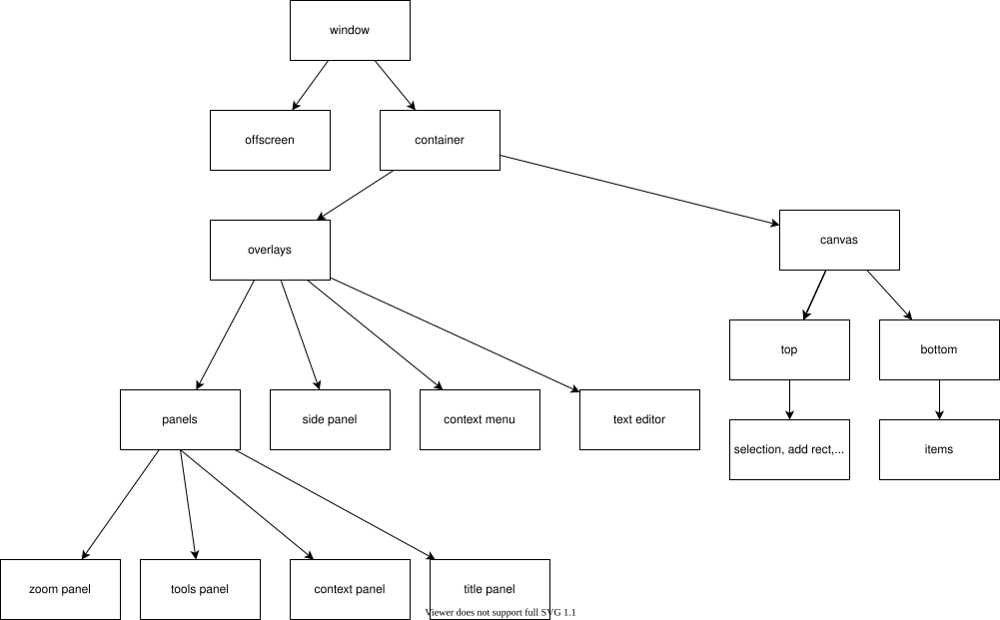

# View

## React state pattern

React is a library to produce objects that describe a composition of HTML elements to create and update a DOM element that matches the composition.

React is a View in Model View Controller (MVC) pattern. The state of an App is usually contained outside of React in some kind of Model implemented in many different ways with or without any dedicated library. React is called to provide a View of the state of an App (Model) Some simple state can be handled by React itself.

React component's `render` method produces an object that describes a composition of HTML elements.

`const root = ReactDOM.createRoot(reactElement: React.ReactElement, htmlElement: HTMLElement)` mounts a React element on to a DOM element.

`root.render(props)` produces a new object that describes a composition of HTML elements and updates the mounted DOM element to match the composition.

React renders the composition when the `React.createElement(component, props, ...children)` is called (JSX expressions `<Component {...props}>{...children}</Component>` are compiled into the calls to the `React.createElement`).

React rerenders the composition and updates the mounted DOM element to match it:

1. When the `root.render(props)` is called
2. After the component's `setState()` method is called
3. When the component's `forceUpdate()` method is called

The composition depends on values of:

1. `this.props` - object passed as an argument to the `root.render` or the `React.createElement`. The object can hold primitive values that you computed outside of the component.
2. `this.state` - object created at the component construction time or updated with the component's `setState()` method. The object can hold simple values that you change in event handlers and do not need outside of the component (in any parent og the component or another branch of the components tree).
3. `this.context` - object passed from a nearest context provider parent. The object can hold simple values that you need in a lot of components in a tree (a shortcut not to pass values through props).
4. any value that you request from any object in the components `render` method. You have to subscribe to the changes to the value, observe the changes and call the `forceUpdate` method of the component to force a rerender.

React components call hooks during their lifecicle:

1. `componentDidMount` - after component is mounted to the DOM element. Use to subscribe to native events and subjects in the model, read values from the DOM element or change them.
2. `componentDidUpdate` - after the DOM element is updated to match the object constructed by the components `render` method. Use to read values from the DOM element or change them.
3. `componentWillUnmount` - before the component will be unmounted from the DOM element and the DOM element will be destroyed. Use to unsubscribe from the native events and subjects in the model.
